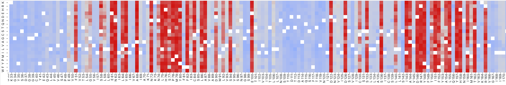
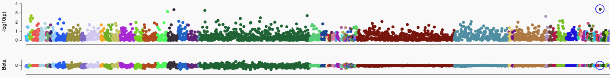

# Hauser Group — Take Home
### Important
**We respect your time, so please do not spend more than ~2 hours.** If you run out of time, just state so. This is by no means an exam and there is no pass or fail. It is a way for you to get a sense of work you could be doing and a way for us to get a sense of which project might be a fit for you. That being said, we value code documentation, accesibility, and useability just as much as we do technical flair.

### Introduction
One of the questions we are interested in in the group is how changes in G-protein coupled reeceptor (GPCR) function can be linked to disease and medication phenotypes. In this toy example, you will explore the link between missense variants in the μ opioid receptor gene (_OPRM1_) and alcohol intake in the UK Biobank.

You will be working with two datasets that can be found in the [HauserGroup/take_home](https://github.com/HauserGroup/take_home) repo:
 - `data/genebass_oprm1_alcohol_intake.tsv` contains real data on the association between _OPRM1_ variants and alcohol intake phenotype from 394,000 British individuals who have been exome sequenced and phenotyped. The data has been pulled from Genebass and lightly tidied for you (see [here](https://app.genebass.org/gene/ENSG00000112038/phenotype/continuous-alcohol_intake_custom-both_sexes--custom?burdenSet=missense%7CLC&phewasOpts=1&resultLayout=small) for the data source and [here](https://doi.org/10.1016/j.xgen.2022.100168) for paper if you are interested). Each row corresponds to a protein variant with the effect size (`beta`) and p-value (`pval`) of the association between the variant and alcohol intake. It also contains information about the allele in the population.
  - `data/GPredCR_Score.json` contains functional scores for a set of variants. A Variant Effect Predictor is a way to _in silico_ predict whether a protein variant is damaging to its protein function (see [here](https://www.ensembl.org/info/docs/tools/vep/index.html) for the Ensembl VEP as an example and [here](https://www.nature.com/articles/s41586-021-04043-8) for a cool newer one if you are more interested). In this case, we are going to use a fictional model, GPredCR (which you can help make a reality!). GPredCR has been trained exclusively on structural data and can predict deleteriousness of GPredCR missense variants. The JSON file is in an Ensembl-like format and for each variant `GPredCR_Score` is the predicted score for that variant (higher is more damaging).

### Instructions
Feel free to work in whatever programming language you are comfortable with but note that we mainly work in **R or Python**. If you get stuck on a question, feel free to skip it. Similarly, if something is unclear to the point where you cannot get started, feel free to reach out. **We would like to be able to quickly understand and run your code ourselves, so please keep that in mind**.

**The main question we want answered is whether the GPredCR score correlates with alcohol intake i.e. do more deleterious variants have a larger phenotypic effect? Therefore:**

0. Create an environment however you prefer; pip, Mamba, PDM, Rye, etc.
1. Annotate each variant in the Genebass table with GPredCR scores by joining the two datasets on variant. You may have to do some data wrangling and cleaning to achieve this.
2. Plot the phenotype effect against the score in whichever form you think would be informative. If you did not get the join to work, you can plot against `allele_frequency` instead.
3. Fit a **simple** model to the data. Briefly, evaluate its performance. You can again use `allele_frequency` if the join did not work.
4. Briefly (a handful of sentences or so) comment on your findings. Is there a biological interpretation? Does anything stand out to you? What would your next steps be?

We have made a Python pseudocode example to help you get started.

### Deliverables
Please return your code, setup files, and all outputs either as a GitHub repository, DropBox, Google Drive or Zip (if you do, please confirm in a separate email that we received the ZIP).

### Images

_An example of deleteriousness scores in some protein (**Not OPRM1!**). Along the x-axis is each position in the protein and the y-axis is each possible amino acid substitution. Red denotes more damaging mutants_

_A Manhattan plot showing phenotypic associations in Genebass for all OPRM1 variants in aggregate. Each colored dot is a phenotype and associated -log10(P) and Beta is shown on the y-axis. Alcohol intake is marked with blue circle._
