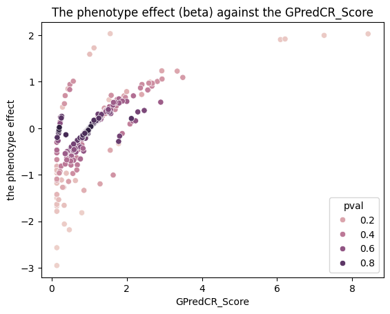
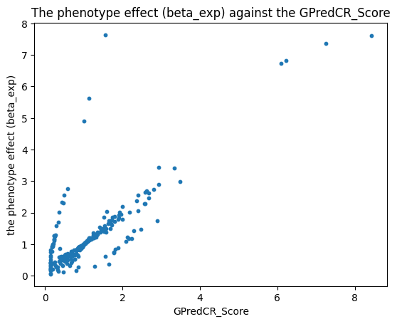
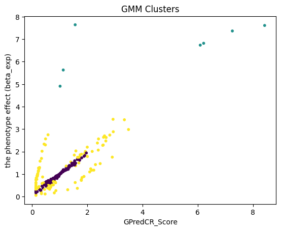
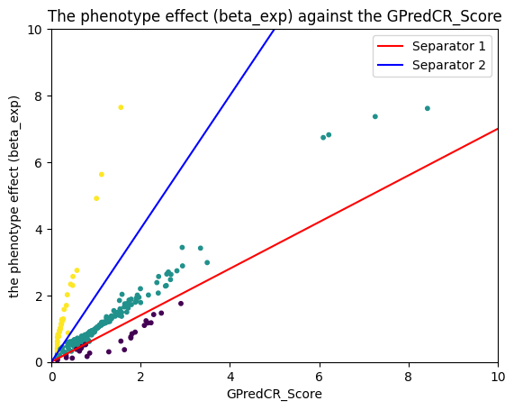
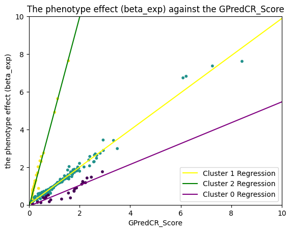
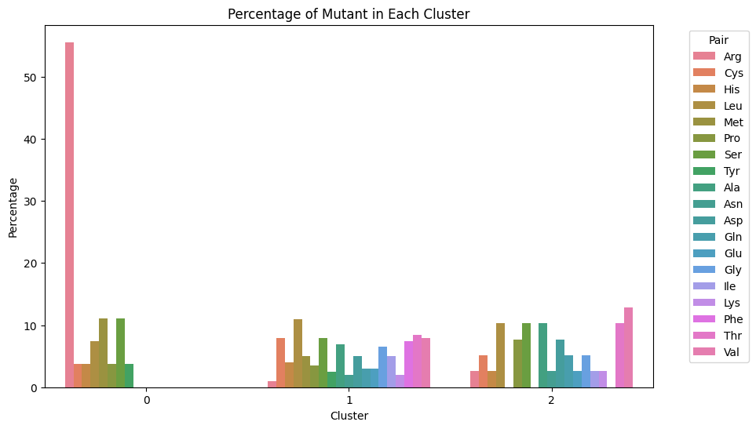
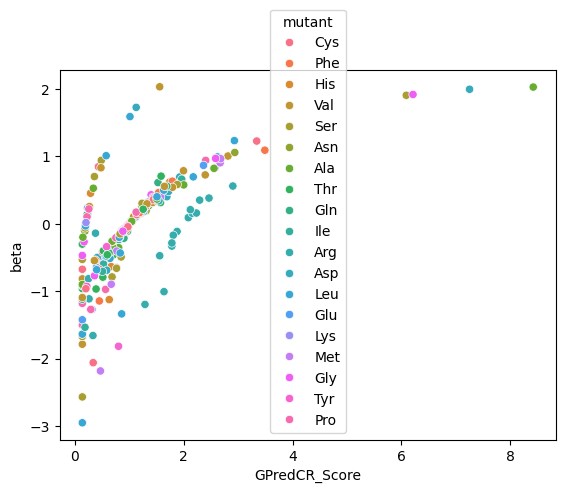
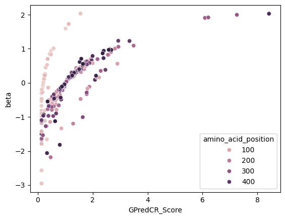

# Analysis of Gene Mutation on OPRM1 and Its Relation to Alcohol Intake

## Environment
This notebook runs in a conda environment defined in environment.yml. Create the environment with `conda env create -f environment.yml` and run the notebook to produce the results.

## Introduction
This project aims to analyze the relationship between gene mutations on the OPRM1 gene and alcohol intake phenotype. The analysis is based on the provided dataset `genebass_oprm1_alcohol_intake.tsv` and the database `GPredCR_Score.json`. The primary focus is on examining the relationship between the beta value (beta_exp) and the GPredCR_Score, to discuss if deleterious variants have a larger phenotypic effect.

## Data Analysis

### Initial Observations
Plotting the effect size against GPredCR_Score (short as Score in the below text) with relevant p-vals shows that the variants near beta=0 the p-vals are generally higher, indicating that the relationship between the variant and the phenotype is probable to be happening by chance.
#### Scatter Plot

The plot also showed general trends of growing beta value as Score gets higher on the x-axis. This may suggest a rough positive correlation, but the quantitative relationship isn't obvious from the plot. There also seems to be three rough trends in the data points, which may indicate the possibility to further cluster the data.

### Clustering Approach
To better understand the quantitative relationship between beta and Score, a exponential transform was applied to the beta values. After the transformation, there is a clearer linear relationship between the two values as shown in the plot.
#### Transformed Scatter Plot

After the transformation the data seems more divided. However, traditional clustering methods like Gaussian Mixture Model (GMM) did not yield satisfying results due to the unbalanced nature of the dataset.
#### Scatter Plot with GMM

Therefore, manual linear separators were devised to achieve better clustering results. The data points were clustered into three groups, and a linear regression was fitted for each cluster.
#### Scatter Plot with Linear Separators

#### Scatter Plot with Cluster-wise Regressions

### Regression Analysis
A model was created to predict the beta_exp value based on the GPredCR_Score. Since there are three clusters, the model predicts a new value by locating the cluster with the variant id and the corresponding model for the cluster. The model achieved a Training Mean Absolute Percentage Error (MAPE) of 12.5252%. This indicates a linear correlation between the exponential of beta values and the GPredCR_Score. However, the conclusion is not confident due to the lack of validation and the possibility of overfitting using a simple linear regression model.

### Clustering Discussion
To validate the clustering, the percentage of mutant amino acids in each cluster was plotted. The results showed a significant difference in the mutant amino acid distribution in Cluster 0, where over 50% of the mutant amino acids resulted in Arg. The same result is visualized with the scatter plot. This may indicate a unique biological pattern in the cluster, but it could also be due to the limited sample size.

#### Mutant Amino Acid Distribution

#### Scatter Plot with Mutant Amino Acid

The other clue supporting the clustering is the amino acid position as shown on the scatter plot below. The plot indicates that the cluster with a great rate of beta value growth are all happening at small position indices.

#### Scatter Plot with AA position

## Conclusion
The analysis suggests a rough positive linear correlation between the exponential of beta values and the GPredCR_Score. That means, increase of the GPredCR_Score correspons to a ln order growth of the effect size. However, due to the potential overfitting and lack of validation, this conclusion should be considered unrefined. A simpler linear regression model could be built on the data without further clustering, but presumably with a higher testing error. 

From the clustering result, it is observed that the variants with amino acid mutations at smaller position numbers grow in the effect size much faster with the increase in GPredCR_Score. This could indicate biological difference introduced by the position of the mutant. Based on the general trend, the variants with high values of beta and Score with low p-vals are found to be 6-154090064-G-T, 6-154090107-T-G, 6-154090137-G-A and 6-154091336-A-C.

For next steps, further investigations can be carried out on discussing the difference that amino acid position may bring on the GPredCR_Score since the observed group of variants are exhibiting high beta value despite low Scores compared with other groups. On the other hand, collecting more data with the mutant resulting in Arg may help us understand better whether it should be considered a different cluster of variants. 